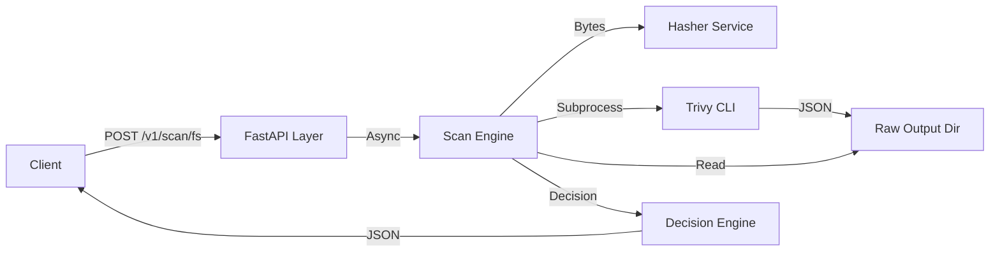

# Developer Guide & Architecture

This document provides a technical deep-dive into the Trivy FS Scan API PoC. It is intended for developers who need to understand the internal workings, modify the codebase, or graduate the project from PoC to production.

## 1. Architecture Overview

 The service is a **FastAPI** application that acts as an orchestration layer around the **Trivy** CLI.

### Core Design Decisions
- **Subprocess Execution**: We invoke `trivy` as a subprocess rather than using a library. This ensures we always use the official, updated binary logic and simplifies dependency management, though it adds process overhead.
- **Sync/Async Hybrid**: The FastAPI layer is `async`, but file I/O and CPU-bound tasks (hashing, scanning) are executed in thread pools using `asyncio.to_thread` to prevent blocking the event loop.
- **Persistence**: Raw Trivy output is persisted to disk immediately. The API filters and summarizes this data but never returns the full raw JSON to keep responses lightweight and readable.

## 2. Component Responsibilities

### `app/main.py`
- **Entrypoint**: Configures the FastAPI app and logging.
- **Middleware**: Implements a global semaphore to limit concurrent scans (`MAX_CONCURRENT_SCANS`), preventing server overload from multiple heavy Trivy processes.

### `app/api/`
- **`routes.py`**: Defines HTTP endpoints. Thin wrapper that delegates logic to `ScanEngine`. Handles HTTP error mapping.
- **`models.py`**: Pydantic models defining the strict contracts for Requests and Responses. Serves as the DTO (Data Transfer Object) layer.

### `app/services/`
- **`engine.py` (The Brain)**: 
  - Orchestrates the entire scan lifecycle.
  - Validates paths against `ALLOWED_SCAN_ROOTS`.
  - Calls `hasher` and `scanner`.
  - Parses Trivy JSON output.
  - Applies "Tollgate" logic to generate `BLOCK`/`REVIEW`/`ALLOW` decisions.
- **`scanner.py` (The Muscle)**:
  - Wraps `subprocess.run`.
  - Constructs the specific CLI flags for Trivy.
  - Handles timeouts and error capturing.
- **`hasher.py`**:
  - Computes SHA-256 validation hashes.

### `app/core/config.py`
- Centralized configuration using `pydantic-settings`. Reads from environment variables with defaults.

## 3. Key Workflows

### The Scan Lifecycle (`process_scan`)
1.  **Validation**: Input path is checked to be a regular file (not symlink/dir) and strictly within an allowed root directory.
2.  **Hashing**: SHA-256 computed (CPU bound).
3.  **Scanning**: `trivy fs` executed (I/O & CPU bound). Output written to `/mnt/out/trivy/<uuid>.json`.
4.  **Parsing**: The JSON output is read back to count vulnerabilities and secrets.
5.  **Decision**: Counts are compared against thresholds (e.g., `CRITICAL > 0` = `BLOCK`).
6.  **Response**: Summary constructed and returned.

## 4. Technical Debt & Trade-offs

| Area | Trade-off / Debt | Impact | Remediation Strategy |
| :--- | :--- | :--- | :--- |
| **Security** | **No Authentication** | API is open to anyone with network access. | Implement API Key or OAuth2 bearer token verification middleware. |
| **Security** | **Subprocess Injection Risk** | Low risk due to strict path validation, but `subprocess` is theoretically vulnerable. | Maintain strict usage of `subprocess.run(list)` (never `shell=True`) and strictly validate all input paths. |
| **Perf** | **Sequential Hashing** | Hashing happens before scan. Large files delay the start of the scan. | Stream hashing in parallel with the scan, or pipeline the reading. |
| **Perf** | **Disk I/O** | Trivy writes to disk, then we read it back. Double I/O penalty. | For high throughput, investigate piping Trivy stdout directly to memory (though this loses the "raw persistence" requirement). |
| **Dependency** | **Trivy Wrapper** | We rely on parsing Trivy's specific JSON structure. Updates to Trivy breaking the JSON schema will break our parser. | Pin Trivy versions in Dockerfile. Write contract tests against Trivy output samples. |
| **Scope** | **Single File Only** | Cannot scan directories or archives recursively. | Extend `ScanEngine` to support tarball extraction or recursive directory traversal if requirements change. |

## 5. Development Guide

### Adding a New Scanner Method
1.  Update `ScannerType` enum in `app/api/models.py`.
2.  Update `run_trivy_scan` in `app/services/scanner.py` to handle the new flag.
3.  Update `ScanEngine._parse_trivy_results` to parse the new finding type.

### modifying Tollgate Logic
1.  Edit `_make_decision` in `app/services/engine.py`.
2.  Add a new unit test in `tests/test_engine.py` covering the new case.
